# AssistGen - 智能客服系统

<div align="center">


*基于FastAPI构建的智能客服系统，集成Agent和RAG技术栈*

</div>

## ✨ 特性

- 🤖 **多模型支持**: DeepSeek V3、Qwen2.5、Llama3系列
- 🧠 **智能Agent系统**: 基于LangGraph的多智能体架构  
- 📚 **RAG检索增强**: 微软GraphRAG + 向量数据库
- 🔍 **知识图谱**: Neo4j电商数据模型
- 🚀 **高性能**: FastAPI + Redis缓存
- 🌐 **网络搜索**: SerpAPI集成
- 💬 **会话管理**: 持久化聊天历史
- 🔧 **性能测试**: Ollama基准测试工具

## 🏗️ 系统架构

```mermaid
graph TB
    A[FastAPI Server] --> B[LLM Factory]
    A --> C[LangGraph Agent]
    A --> D[GraphRAG]
    A --> E[Neo4j知识图谱]
    
    B --> F[DeepSeek Service]
    B --> G[Ollama Service]
    
    C --> H[路由Agent]
    C --> I[研究规划器]
    C --> J[知识图谱工具]
    
    D --> K[文档索引]
    D --> L[向量检索]
    
    E --> M[商品数据]
    E --> N[客户关系]
```



### 🔧 核心组件

| 组件 | 描述 |
|------|------|
| **FastAPI应用** | 主服务器，提供聊天、推理、文件上传API |
| **LLM工厂** | 支持DeepSeek和Ollama模型的服务工厂 |
| **LangGraph Agent** | 多智能体系统，处理复杂查询路由 |
| **GraphRAG集成** | 微软GraphRAG文档索引和检索 |
| **Neo4j知识图谱** | 电商数据模型，包含商品、订单、客户信息 |

## 🚀 快速开始

### 环境要求

- Python 3.8+
- Neo4j 4.0+
- Redis 6.0+
- MySQL 8.0+

### 安装部署

1. **克隆项目**
```bash
git clone <repository-url>
cd deepseek_agent
```

2. **创建虚拟环境**
```bash
python -m venv .venv
source .venv/bin/activate  # Linux/Mac
# .venv\Scripts\activate   # Windows
```

3. **安装依赖**
```bash
pip install -r requirements.txt
```

4. **配置环境变量**
```bash
cp llm_backend/.env.example llm_backend/.env
# 编辑 .env 文件，配置API密钥和数据库连接
```

5. **初始化数据库**
```bash
cd scripts
python init_db.py
```

6. **启动服务**
```bash
cd llm_backend
python run.py
```

服务将在 `http://localhost:8000` 启动

## ⚙️ 配置说明

### 模型配置

在 `llm_backend/.env` 中配置：

```bash
# 服务选择 ("deepseek" 或 "ollama")
CHAT_SERVICE=deepseek
REASON_SERVICE=deepseek  
AGENT_SERVICE=deepseek

# API密钥
DEEPSEEK_API_KEY=your_deepseek_key
SERPAPI_KEY=your_serpapi_key
VISION_API_KEY=your_vision_key
```

### 数据库配置

```bash
# MySQL - 会话存储
MYSQL_HOST=localhost
MYSQL_PORT=3306
MYSQL_USER=root
MYSQL_PASSWORD=password
MYSQL_DATABASE=assistgen

# Neo4j - 知识图谱
NEO4J_URI=bolt://localhost:7687
NEO4J_USER=neo4j
NEO4J_PASSWORD=password

# Redis - 缓存
REDIS_HOST=localhost
REDIS_PORT=6379
```

## 📊 API文档

启动服务后访问：
- Swagger UI: `http://localhost:8000/docs`
- ReDoc: `http://localhost:8000/redoc`

### 主要端点

| 端点 | 方法 | 描述 |
|------|------|------|
| `/chat` | POST | 聊天对话 |
| `/reason` | POST | 推理分析 |
| `/upload` | POST | 文件上传 |
| `/langgraph/query` | POST | Agent查询 |
| `/conversation/{id}` | GET | 获取对话历史 |

## 🧪 测试

```bash
# 运行性能测试
cd llm_backend/app/test
python ollama_benchmark.py

# 运行单元测试
pytest tests/
```

## 📁 项目结构

```
deepseek_agent/
├── llm_backend/              # 后端服务
│   ├── app/                  # 应用核心
│   │   ├── services/         # 服务层
│   │   ├── models/           # 数据模型
│   │   ├── api/              # API端点
│   │   └── graphrag/         # GraphRAG集成
│   ├── lg_agent/             # LangGraph智能体
│   ├── main.py               # FastAPI应用
│   └── run.py                # 启动脚本
├── scripts/                  # 工具脚本
├── uploads/                  # 文件上传目录
├── requirements.txt          # 依赖包
└── README.md                 # 项目文档
```

## 🤝 贡献

1. Fork 项目
2. 创建特性分支 (`git checkout -b feature/AmazingFeature`)
3. 提交更改 (`git commit -m 'Add some AmazingFeature'`)
4. 推送到分支 (`git push origin feature/AmazingFeature`)
5. 打开 Pull Request

## 📄 许可证

本项目基于 MIT 许可证开源 - 查看 [LICENSE](LICENSE) 文件了解详情

## 🙋‍♂️ 支持

如有问题或建议，请：

- 📧 提交 Issue
- 💬 参与 Discussions
- 📚 查看 Wiki 文档

---

<div align="center">

**⭐ 如果此项目对您有帮助，请给我们一个星标！**

Made with ❤️ by AssistGen Team

</div> 