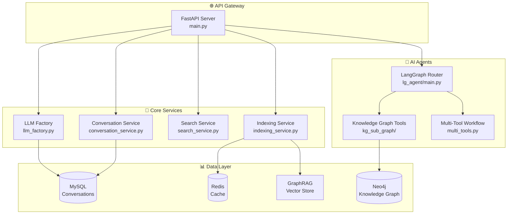

# LLM Backend 🔧

AssistGen 智能客服系统的后端服务核心模块

## 📊 技术栈


## 🏗️ 架构设计



## 🚀 快速启动

### 1. 环境准备

确保您在项目根目录 (`deepseek_agent/`)：

```bash
# 激活虚拟环境
source .venv/bin/activate  # Linux/Mac
# .venv\Scripts\activate   # Windows

# 安装依赖（如果尚未安装）
pip install -r requirements.txt
```

### 2. 配置文件

创建并配置 `.env` 文件：

```bash
cp .env.example .env
```

关键配置项：

```bash
# 🤖 AI 服务配置
CHAT_SERVICE=deepseek          # 聊天服务: deepseek/ollama
REASON_SERVICE=deepseek        # 推理服务: deepseek/ollama  
AGENT_SERVICE=deepseek         # Agent服务: deepseek/ollama

# 🔑 API 密钥
DEEPSEEK_API_KEY=sk-xxxxx      # DeepSeek API密钥
SERPAPI_KEY=xxxxx              # SerpAPI搜索密钥
VISION_API_KEY=xxxxx           # 视觉模型密钥

# 🗄️ 数据库连接
MYSQL_HOST=localhost
MYSQL_PORT=3306
MYSQL_USER=root
MYSQL_PASSWORD=your_password
MYSQL_DATABASE=assistgen

NEO4J_URI=bolt://localhost:7687
NEO4J_USER=neo4j
NEO4J_PASSWORD=your_password

REDIS_HOST=localhost
REDIS_PORT=6379
```

### 3. 启动服务

```bash
# 进入后端目录
cd llm_backend

# 方式1: 直接启动
python run.py

# 方式2: 使用 uvicorn
uvicorn main:app --host 0.0.0.0 --port 8000 --reload
```

🎉 服务启动后访问：
- **API文档**: http://localhost:8000/docs
- **ReDoc**: http://localhost:8000/redoc
- **健康检查**: http://localhost:8000/health

## 📚 API 接口

### 核心端点

| 端点 | 方法 | 描述 | 示例 |
|------|------|------|------|
| `/chat` | POST | 💬 聊天对话 | 智能客服对话 |
| `/reason` | POST | 🧠 推理分析 | 复杂问题推理 |
| `/upload` | POST | 📤 文件上传 | RAG文档上传 |
| `/langgraph/query` | POST | 🤖 Agent查询 | 多智能体任务 |
| `/conversation/{id}` | GET | 📋 对话历史 | 获取聊天记录 |
| `/conversation/` | GET | 📊 对话列表 | 分页获取对话 |

### 请求示例

#### 💬 聊天接口

```bash
curl -X POST "http://localhost:8000/chat" \
  -H "Content-Type: application/json" \
  -d '{
    "message": "你好，我想了解这个产品",
    "conversation_id": "uuid-string",
    "user_id": "user123"
  }'
```

#### 🤖 Agent查询

```bash
curl -X POST "http://localhost:8000/langgraph/query" \
  -H "Content-Type: application/json" \
  -d '{
    "conversation_id": "uuid-string",
    "query": "帮我分析当前市场趋势",
    "thread_id": "thread-uuid"
  }'
```

#### 📤 文件上传

```bash
curl -X POST "http://localhost:8000/upload" \
  -F "files=@document.pdf" \
  -F "user_uuid=user123"
```

## 🛠️ 开发指南

### 项目结构详解

```
llm_backend/
├── 🚀 main.py                    # FastAPI应用入口
├── ▶️ run.py                     # 服务启动脚本
├── 📁 app/
│   ├── 🌐 api/                   # API路由模块
│   │   └── auth.py               # 认证相关接口
│   ├── ⚙️ core/                  # 核心配置
│   │   ├── config.py             # 环境配置管理
│   │   ├── database.py           # 数据库连接
│   │   ├── logger.py             # 日志配置
│   │   ├── middleware.py         # 中间件
│   │   └── security.py           # 安全配置
│   ├── 📊 graphrag/              # GraphRAG集成
│   │   ├── graphrag/             # 核心GraphRAG模块
│   │   ├── dev/                  # 开发工具
│   │   └── origin_data/          # 原始数据处理
│   ├── 🤖 lg_agent/              # LangGraph智能体
│   │   ├── main.py               # Agent入口
│   │   ├── lg_states.py          # 状态定义
│   │   ├── lg_prompts.py         # 提示词模板
│   │   └── kg_sub_graph/         # 知识图谱子图
│   ├── 🗄️ models/                # 数据模型
│   │   ├── chat.py               # 聊天模型
│   │   ├── conversation.py       # 对话模型
│   │   ├── message.py            # 消息模型
│   │   └── user.py               # 用户模型
│   ├── 💬 prompts/               # 提示词模板
│   │   └── search_prompts.py     # 搜索提示词
│   ├── 🔧 services/              # 业务服务
│   │   ├── llm_factory.py        # LLM服务工厂
│   │   ├── deepseek_service.py   # DeepSeek服务
│   │   ├── ollama_service.py     # Ollama服务
│   │   ├── search_service.py     # 搜索服务
│   │   ├── conversation_service.py # 对话服务
│   │   ├── indexing_service.py   # 索引服务
│   │   └── embedding_service.py  # 向量嵌入服务
│   ├── 🧪 test/                  # 测试文件
│   │   ├── ollama_benchmark.py   # 性能基准测试
│   │   ├── deepseek_sync.py      # DeepSeek同步测试
│   │   └── test_fastapi.py       # FastAPI接口测试
│   └── 🛠️ tools/                 # 工具模块
│       ├── definitions.py        # 工具定义
│       └── search.py             # 搜索工具
└── 📁 scripts/                   # 工具脚本
    └── init_db.py                # 数据库初始化
```

### 添加新功能

#### 1. 🆕 添加新的API端点

```python
# app/api/new_feature.py
from fastapi import APIRouter

router = APIRouter()

@router.post("/new-feature")
async def new_feature_endpoint():
    return {"message": "New feature"}
```

在 `main.py` 中注册：

```python
from app.api.new_feature import router as new_feature_router
app.include_router(new_feature_router, prefix="/api/v1")
```

#### 2. 🔧 添加新的服务

```python
# app/services/new_service.py
from app.core.logger import get_logger

logger = get_logger(service="new_service")

class NewService:
    def __init__(self):
        self.initialized = True
        
    async def process_data(self, data):
        logger.info("Processing data...")
        return processed_data
```

#### 3. 🤖 扩展Agent功能

在 `lg_agent/` 目录下添加新的状态和工具：

```python
# lg_agent/new_agent_tools.py
from langchain.tools import tool

@tool
def new_agent_tool(query: str) -> str:
    """新的Agent工具"""
    return f"Processed: {query}"
```

## 🧪 测试与调试

### 性能测试

```bash
# 进入测试目录
cd app/test

# Ollama模型性能测试
python ollama_benchmark.py

# DeepSeek同步调用测试
python deepseek_sync.py

# DeepSeek流式调用测试  
python deepseek_stream.py

# FastAPI接口测试
python test_fastapi.py
```

### 调试模式

启动开发服务器（自动重载）：

```bash
python run.py
# 或者
uvicorn main:app --reload --log-level debug
```

### 日志查看

日志配置在 `app/core/logger.py`，支持结构化日志：

```python
from app.core.logger import get_logger, log_structured

logger = get_logger(service="my_service")
logger.info("Service started")

# 结构化日志
log_structured("user_action", {
    "user_id": "123",
    "action": "chat",
    "timestamp": datetime.now()
})
```

## 🔒 安全配置

### API认证

当前支持基础认证，可在 `app/api/auth.py` 中扩展：

```python
from app.core.security import verify_token

@app.middleware("http")
async def auth_middleware(request: Request, call_next):
    # 实现JWT或其他认证逻辑
    pass
```

### 环境变量

敏感信息通过环境变量管理，参考 `app/core/config.py`

## 🚀 部署建议

### 生产环境配置

```bash
# 生产环境启动
uvicorn main:app --host 0.0.0.0 --port 8000 --workers 4

# 使用Gunicorn + Uvicorn
gunicorn main:app -w 4 -k uvicorn.workers.UvicornWorker
```

### Docker 部署

```dockerfile
FROM python:3.9-slim

WORKDIR /app
COPY requirements.txt .
RUN pip install -r requirements.txt

COPY llm_backend/ .
EXPOSE 8000

CMD ["python", "run.py"]
```

### 监控与日志

- 使用 `loguru` 进行结构化日志记录
- 集成 Prometheus metrics（可选）
- 健康检查端点：`/health`

## 🤝 贡献指南

1. **代码规范**: 遵循 PEP 8 编码规范
2. **提交格式**: 使用语义化提交信息
3. **测试覆盖**: 新功能需要添加测试用例
4. **文档更新**: 更新相关API文档


---

<div align="center">

**🔧 LLM Backend - AssistGen 核心服务**

*基于 FastAPI + LangGraph + GraphRAG 构建*

</div>